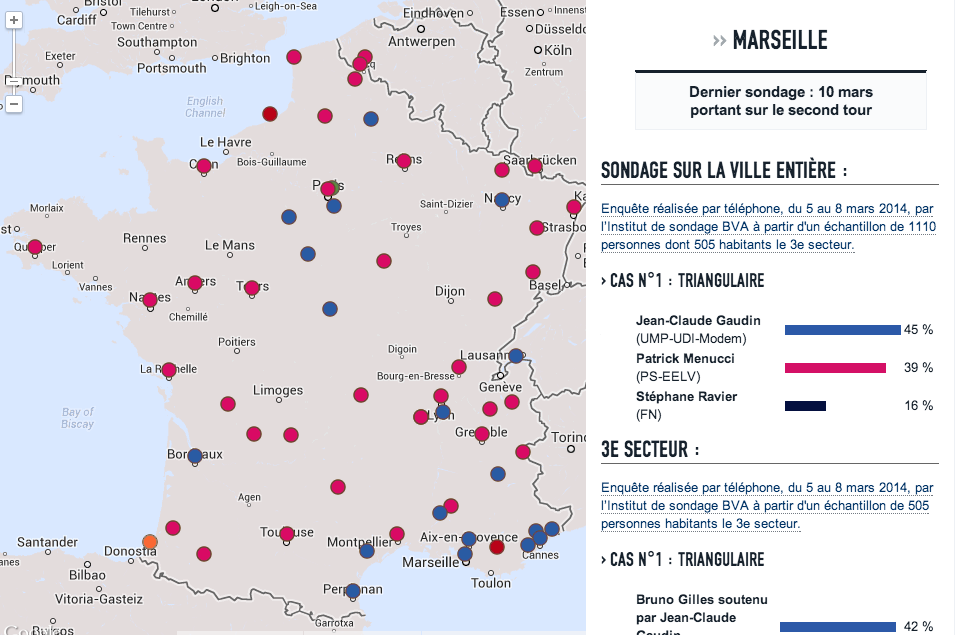
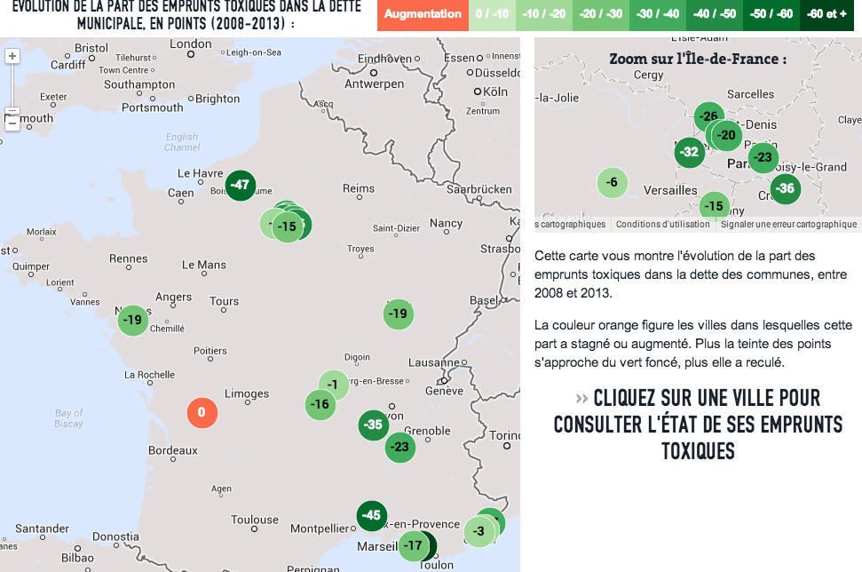
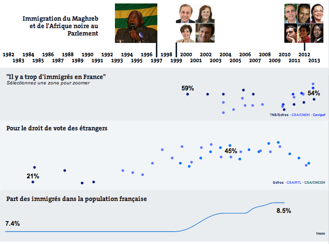

# Productions pour Le Monde.fr

## [Municipales : allez-vous élire un futur cumulard ?](cumul-municipales) ##
Carte de France (Google maps) des candidats aux municipales qui se retrouveraient en situation de cumul des mandats en cas d'élection aux municipales de mars 2014. Alimentée par une Google Spreadsheet (avec [Gselper](https://github.com/Pirhoo/LODP/tree/master/Gselper)), mise à jour avec les contributions des lecteurs. Moteur de recherche géré par [filter.js](https://github.com/jiren/filter.js)

[>> Voir sur Le Monde.fr](http://www.lemonde.fr/municipales/visuel/2014/02/28/municipales-allez-vous-elire-un-futur-cumulard_4368751_1828682.html)

## [NSA : la pieuvre de la cybersurveillance](nsa) ##
Visualisation des programmes de la NSA et de ses partenaires en SVG et JSON.

[>> Voir sur Le Monde.fr](http://www.lemonde.fr/technologies/visuel/2013/08/27/plongee-dans-la-pieuvre-de-la-cybersurveillance-de-la-nsa_3467057_651865.html)

## [Littérature : les éditeurs qui raflent tous les prix](prix-litteraires) ##
Visualisation des principaux prix littéraires sur un siècle, avec un streamgraph d3.js.

[>> Voir sur Le Monde.fr](http://www.lemonde.fr/livres/visuel/2013/11/30/prix-litteraires-les-maisons-d-edition-qui-regnent-sur-les-classements_3523087_3260.html)

## [Comparateur de sondages pour les municipales](comparateur-sondages-municipales) ##
Carte de France (Google maps) des sondages par ville pour les élections municipales de mars 2014. Alimentée par une Google Spreadsheet avec Gselper(https://github.com/Pirhoo/LODP/tree/master/Gselper).

[>> Voir sur Le Monde.fr](http://www.lemonde.fr/municipales/visuel/2014/03/14/municipales-la-carte-des-sondages-ville-par-ville_4383421_1828682.html)

## [Carte des emprunts toxiques](emprunts-toxiques) ##
Carte (Google maps) mettant en forme les données de l'enquête de Mathilde Damgé(http://www.twitter.com/dathilde) sur les emprunts toxiques consentis par les villes. Alimentée par une Google Spreadsheet avec Gselper(https://github.com/Pirhoo/LODP/tree/master/Gselper).

[>> Voir sur Le Monde.fr](http://www.lemonde.fr/les-decodeurs/visuel/2014/03/13/le-scandale-des-emprunts-toxiques-six-ans-apres-que-sont-ils-devenus_4381119_4355770.html)

## [Trente ans après la Marche pour l'égalité, où en est la société française ?](marche-egalite) ##
Tableau de bord chronologique à l'occasion du trentenaire de la marche pour l'égalité et contre le racisme, à base de Highcharts.

[>> Voir sur Le Monde.fr](http://www.lemonde.fr/societe/visuel/2013/10/12/trente-ans-apres-la-marche-pour-l-egalite-ou-en-est-la-societe-francaise_3494363_3224.html)

